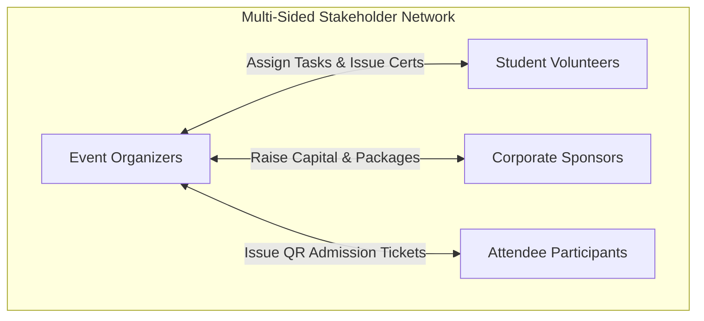
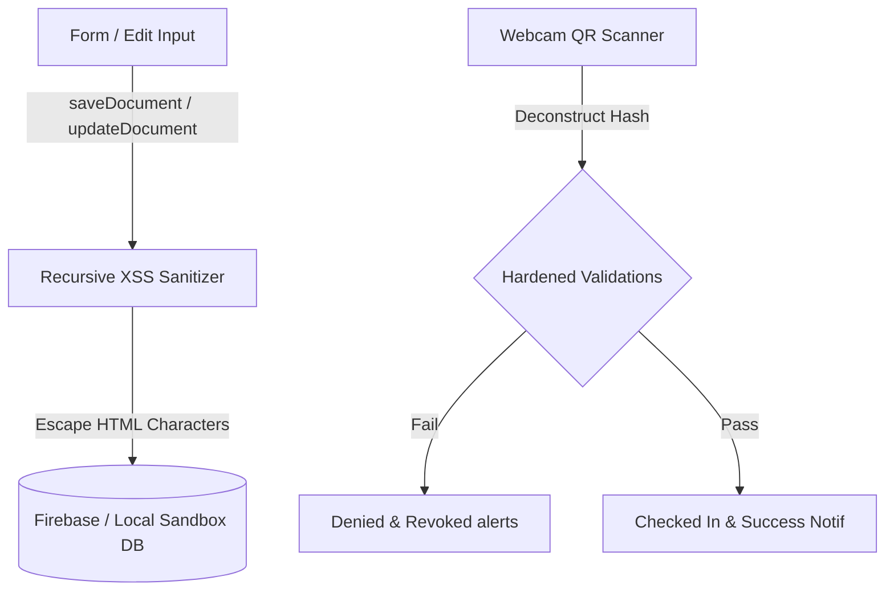

# ✨ NexEvent Hub Platform
### *The Ultimate Multi-Sided Student Event Orchestration & Verifiable Recognition Ecosystem*

[](https://vite.dev)
[](https://react.dev)
[](#)
[](#)

---

## 🚀 The Vision

Student hackathons, cultural festivals, and academic symposiums are complex networks of **Organizers**, **Participants**, **Volunteers**, and **Sponsors**. Traditionally, these parties coordinate across fragmented platforms, leading to lost sponsor engagement, unverified volunteer certificates, and tedious physical check-in lines.

**NexEvent Hub** is a visual campus event command center. It Unifies all four stakeholders in a responsive **dark-mode glassmorphic** experience. Built on a secured, offline-resilient database, it features high-fidelity visual certificate builders, dynamic verifier portals, webcam QR scanners, and automated outbound transactional mailers.

---

## 🎭 The Four Multi-Sided Pillars



### 1. 📢 Event Organizers
- **6-Step Event Wizard:** Draft and publish events, configure capacities, ticket pricing, and allow single/team registrations.
- **Backstage Kanban Board:** Create operations tasks, assign them to volunteers, and track completions in real-time.
- **Webcam QR Scanner:** Process live ticket scans at check-in desks using real-time webcam feeds or manual overrides.
- **Ledger Certificates Dispatch:** Conclude events to auto-generate and issue verifiable certificates to all checked-in attendees and active volunteers.

### 2. 🎖️ Student Volunteers
- **Competency Matchmaker:** Interactive dashboard that calculates competency match scores (%) between the volunteer's skills and open event roles.
- **Gamified Task Coordinator:** Track assigned tasks on an interactive Kanban board. Completing tasks awards XP points and ranks you on the global leaderboard.
- **Credentials Portfolio:** View, download, and email A4 landscape landscape-formatted certificates.

### 3. 🎟️ Attendee Participants
- **Live Discovery Catalog:** Filter and search offline, online, and hybrid hackathons or workshops.
- **Secure Ticket Drawer:** Store registered passes featuring a dynamic QR code pre-seeded with validation keys.
- **Visual Certificate Center:** Manage and view verified certificates in aRadial-glow radial gold card preview.

### 4. 🤝 Corporate Sponsors
- **Sponsorship Hub:** Review matching events based on industry sector, marketing budget ranges, and target audience alignment.
- **Interactive Stall Contracts:** Commit capital to unlock Platinum or Gold partnership layers with embedded sponsor perks.

---

## 🌟 Premium Features

### 🏆 Visual Certificate Center with Ledger Lock
- ** radial glow card frame:** Renders a gorgeous gold-bordered (`5px double #d97706`) certificate, customized using cursive signatures (*Great Vibes* Google Font) and gold-trophy SVG emblems.
- **Ledger Lock Custodian:** Provides inputs for attendees to correct names (add initials or casing) in real-time. A prominent alert notes: *“Ledger Lock: Adjustments made here are for print layout styling only and do not alter the secure, digitally hashed credential record.”*
- **Perfect A4 Landscape Print Engine:** Populates an isolated landscape window with `@media print` rules, removing all scrollbars, sidebars, and nav elements for pixel-perfect printing.

### 🔍 Dynamic Public Verifier (`#/verify/:code`)
- Spawns a dedicated verifier route that uses a **deliberate pulse-skeleton loading state** to prevent visual layout shifts.
- Upon matching database legitimacy, it triggers a **sweeping border checkmark glow** and an **elastic scale-up success animation** to display verified recipient details, issue dates, and unique cryptographic hashes.

### 📨 Outbound Transactional Mail Dispatcher
- Provides an **interactive simulated mail sandbox** (Gmail, Outlook, Yahoo Mail, and Default Mail app deep links).
- Resolves browser text compose limits by compiling a **direct, scannable QR Code image URL (`api.qrserver.com`)** inside the pre-filled plain-text email bodies, allowing recipients to instantly pull up passes on their phones.
- Includes a **"Copy QR Image URL"** button for flexible 1-click clipboard capturing.

### 💼 Branded LinkedIn Passport Integrations
- Step 2 of signup includes a global **LinkedIn Profile URL** field for all roles.
- The dynamic public passport portal (`#/passport/:username`) renders custom role badges (*Event Organizer*, *Sponsor Partner*, *Attendee*, *Elite Vanguard*), hides XP metrics for non-volunteers, and embeds a **branded LinkedIn Social Badge** (`#0a66c2`) with inline vector icons in the header.

---

## 🔒 Security Architecture



- **Database-Wide XSS Protection:** The write layer (`saveDocument` and `updateDocument` in `src/dbService.js`) recursively scans and sanitizes all incoming string fields (replacing `< > " ' /` special characters) to prevent database-stored Cross-Site Scripting (XSS) attacks.
- **Hardened QR Ticket Check-In:**
  - **Decoupled Hashing:** Validation keys are constructed using secure relative mappings (`eventId|userId|reg`) encoded in `base64`.
  - **Cross-Event Guard:** Prevents attendees from check-in attempts using ticket passes from other events.
  - **Double-Check In Prevention:** Cross-references scanned ticket states in real-time to block duplicate scans.
  - **Rate Limiting:** Enforces a 5-second session scan delay to prevent brute-force API checks at the admissions desk.
- **Enterprise Firestore Rules:** `firestore.rules` blocks unauthorized document modifications, allowing public reads on certificates while locking event/role definitions to organizers.

---

## 🛠️ Tech Stack & Build Telemetry

- **Core:** React (v19), Vite (v8)
- **Icons:** Lucide React (v1)
- **Scanner:** HTML5-QRCode (v2)
- **Resilient Static Deployments:** Pre-configured with Hash Routing and relative base directories (`base: './'`) in `vite.config.js` to ensure the project deploys flawlessly on any static platform (Vercel, Netlify, or GitHub Pages subdirectories) without breaking asset paths or page reloads.

### ⚡ Build Output:
```bash
vite v8.0.14 building client environment for production...
transforming...✓ 1788 modules transformed.
rendering chunks...
computing gzip size...
dist/index.html                     0.46 kB │ gzip:   0.30 kB
dist/assets/index-CDu9Dyb_.css     12.13 kB │ gzip:   3.13 kB
dist/assets/index-D93ObSnU.js   1,119.51 kB │ gzip: 320.06 kB

✓ built in 1.37s
```

---

## 🏁 Quick-Start & Evaluation Sandbox

### 1. Launching Locally:
```powershell
# Clone the repository
git clone https://github.com/shaikzz-collab/NexEvent.git
cd NexEvent

# Install dependencies
npm install

# Start local server
npm run dev
```
*Open [http://localhost:5173/](http://localhost:5173/) (or the next available port indicated) to load the site.*

### 2. Pre-Seeded Evaluation Credentials:
NexEvent Hub comes pre-seeded with rich sandbox data inside local storage on first load. You can immediately log into the following evaluation profiles to test the platform:

| Profile Role | Email Address | Password / Action | Key Feature to Test |
| :--- | :--- | :--- | :--- |
| **Event Organizer** | `organizer@college.edu` | *Any password* | Host events, approve volunteers, scan QR tickets, click **"End Event"** to issue certs. |
| **Student Volunteer** | `rahul@gmail.com` | *Any password / Explore Demo* | Discover matched roles, advance Kanban tasks, view/print gold landscape certificates. |
| **Corporate Sponsor** | `innovatetech@sponsor.com` | *Any password* | Evaluate sponsorship categories, invest in Platinum/Gold packages. |
| **Attendee Participant** | `sumit@gmail.com` | *Any password* | Claim live event tickets, email scannable QR ticket passes, view certificates. |

---

*Made with 💖 for high-fidelity event orchestration.*
